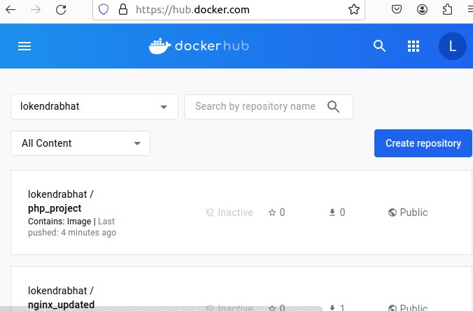
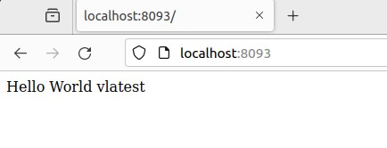

Steps I followed:
## Task 1
1.1: Open VM with Ubuntu 22.04 version and perform 
 <code>cd ~/Desktop/DevOps/
mkdir intuji-devops-internship-challenge
cd intuji-devops-internship-challenge</code>
 
1.2: Inside the directory 
- Initialized the git in that repository (Note: I already installed git)
 <code>git init </code> 
- Create a file using the following command and write the required script to download docker using the help of the docker official page from where I observe the commands used in Ubuntu for download. And then save written contents (esc + :wq for vim)
 <code>vim dockerinstaller.sh<code> 
- Perform required git commands after each step as(for example):
 <code>git add . 
git commit –m “<commit-message>”
git status</code> 

1.3: It’s very important to permit to .sh file to execute 
	 <code> chmod +x dockerinstaller.sh
	 ./dockerinstaller.sh  # to run the script
	</code> 

## Task 2
2.1: Cloned the given GitHub repository using the command
 <code> git clone replace-url </code> 
2.1.1: Creating Dockerfile for building a docker image of the cloned application.
 <code> touch Dockerfile </code> 
After many tries, I try to solve the error using logs and with the help of Google. I build an entry point for a given project where I instantiated class Hello()
 <code>vim index.php</code> 
After successfully running a project on a local machine I write a Dockerfile and then build and run it as:
 <code>docker build -t lokendrabhat/php_project:1.0 . </code> 
Make sure to check the port available locally using the command <code>sudo lsof -i :80</code> or other commands
 <code>docker run -d -p 80:80 lokendrabhat/php_project:1.0 </code> 
Finally pushed to my DockerHub 
 <code>docker push lokendrabhat/php_project:1.0</code> 

## Task 3
- Downloaded docker-compose
 <code>sudo apt install -y docker-compose</code> 
- Check download
 <code>docker-compose --version</code> 

- Created a docker-compose file
 <code>touch docker-compose.yml</code> 
- write using any editing tools vim, nano, or VS-code (I used VS-code for that)
- To check the docker-compose file
 <code> docker-compose config </code> 
- To up the container
 <code> docker-compose up -d </code> 

# Output:
  
- To down the container
 <code> docker-compose down </code> 

## Task 4
- Installed jenkins with the help of the official jenkins website. For that, first Install Java
 <code> sudo apt update
sudo apt install fontconfig openjdk-17-jre
java -version </code> 
- Then Jenkins:
 <code> sudo wget -O /usr/share/keyrings/jenkins-keyring.asc \
  https://pkg.jenkins.io/debian-stable/jenkins.io-2023.key
echo deb [signed-by=/usr/share/keyrings/jenkins-keyring.asc] \
  https://pkg.jenkins.io/debian-stable binary/ | sudo tee \
  /etc/apt/sources.list.d/jenkins.list > /dev/null
sudo apt-get update
sudo apt-get install jenkins </code> 
- check Jenkins installation
 <code> jenkins --version
service jenkins status </code> 

- Now, your Jenkins runs on the default site: http://localhost:8080. Where required configuration is done and plugins are installed
- Here is output
  

